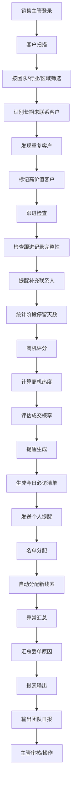

## 1. 产品概述

客户关系管理自动化工具（CRM Automation Tool），专为销售主管设计，用于每日自动整理客户跟进质量，提升销售团队效率和客户管理水平。

- **核心目标**：自动化客户扫描、跟进检查、商机评估、提醒生成、线索分配、异常汇总和报表输出七大核心流程
- **目标用户**：销售主管、销售团队负责人、客户经理
- **产品价值**：减少人工统计成本、提升跟进质量、发现销售异常、优化线索分配

## 2. 核心功能

### 2.1 用户角色

| 角色 | 登录方式 | 核心权限 |
|------|----------|----------|
| 销售主管 | 账号登录 | 全功能访问、团队管理、名单排除、报表查看 |
| 销售人员 | 账号登录 | 个人客户管理、跟进记录、查看个人提醒 |

### 2.2 功能模块

1. **客户扫描模块**：按团队/行业/区域筛选客户、识别长期未联系客户、发现重复客户、标记高价值客户
2. **跟进检查模块**：检查跟进记录完整性、提醒补充联系人、统计阶段停留天数
3. **商机评分模块**：计算商机热度评分、评估成交概率、分级展示商机
4. **提醒生成模块**：生成今日必访清单、发送个人提醒、保留处理记录
5. **名单分配模块**：自动分配新线索、按负载均衡分配、支持手动调整
6. **异常汇总模块**：汇总丢单原因、识别异常客户、标记风险客户
7. **报表输出模块**：输出团队日报、统计关键指标、支持导出

### 2.3 页面详情

| 页面名称 | 模块名称 | 功能描述 |
|----------|----------|----------|
| 仪表盘 | 总览面板 | 关键指标卡片、今日待办、团队概览、趋势图表 |
| 客户扫描 | 客户列表 | 客户表格、按团队/行业/区域筛选、长期未联系识别、重复客户检测 |
| 跟进检查 | 跟进记录 | 跟进完整度检查、联系人补充提醒、阶段停留统计 |
| 商机评分 | 商机列表 | 商机热度评分、成交概率评估、高价值客户标记 |
| 提醒中心 | 提醒列表 | 今日必访清单、个人提醒、处理记录追踪 |
| 线索分配 | 分配管理 | 新线索自动分配、负载均衡、手动调整分配 |
| 异常汇总 | 异常分析 | 丢单原因汇总、风险客户标记、异常数据统计 |
| 数据报表 | 报表中心 | 团队日报、多维度统计、导出功能 |
| 系统设置 | 设置管理 | 团队管理、排除名单、评分规则配置 |

## 3. 核心流程

### 3.1 每日自动化流程

销售主管登录系统后，系统自动执行以下流程：
1. 扫描团队所有客户数据
2. 检查跟进记录完整性
3. 计算商机热度评分
4. 生成今日待办提醒
5. 分配新线索
6. 汇总异常数据
7. 输出团队日报

### 3.2 流程图

## 4. 用户界面设计

### 4.1 设计风格

- **设计理念**：专业商务风格，强调数据可视化和操作效率
- **主色调**：深蓝色系 (#1e3a5f) 作为主色，体现专业可信赖
- **辅助色**：青色 (#0ea5e9) 用于强调和交互，橙色 (#f97316) 用于警示和提醒
- **中性色**：灰色系 (slate/zinc) 用于文字和背景
- **按钮风格**：圆角中等 (rounded-lg)，悬停有微妙阴影和颜色变化
- **字体**：使用现代无衬线字体，标题使用较粗字重，正文清晰易读
- **布局风格**：左侧导航 + 右侧内容区，卡片式布局，数据表格为主
- **图标风格**：线性图标 (lucide-react)，简洁统一

### 4.2 页面设计概览

| 页面名称 | 模块名称 | UI 元素 |
|----------|----------|----------|
| 仪表盘 | 总览面板 | 指标卡片网格、趋势折线图、环形进度图、今日待办列表、快捷操作区 |
| 客户扫描 | 客户列表 | 筛选工具栏、数据表格、标签状态、分页、批量操作 |
| 跟进检查 | 跟进记录 | 进度条、时间线、完整度百分比、提醒卡片 |
| 商机评分 | 商机列表 | 评分仪表盘、热度标签、分级筛选、排序功能 |
| 提醒中心 | 提醒列表 | 分类标签、优先级标记、一键处理、已读/未读状态 |
| 线索分配 | 分配管理 | 分配队列、成员负载卡片、拖拽分配、分配记录 |
| 异常汇总 | 异常分析 | 原因分布图、风险列表、异常统计卡片 |
| 数据报表 | 报表中心 | 多图表组合、时间筛选、导出按钮、报表模板 |
| 系统设置 | 设置管理 | Tab 切换、表单输入、开关组件、排除名单列表 |

### 4.3 响应式设计

- **设计策略**：桌面端优先，适配平板和移动端
- **断点设计**：lg (1024px) 以上为完整布局，md (768px) 以下折叠导航
- **移动端优化**：表格改为卡片列表，侧边栏改为抽屉式，触控按钮尺寸 ≥ 44px

### 4.4 动效设计

- **页面加载**：渐入 + 轻微上移动画，卡片依次延迟显示
- **数据更新**：数字滚动动画，进度条平滑过渡
- **交互反馈**：按钮悬停阴影加深，表格行悬停背景变化
- **状态切换**：Tab 切换使用滑动指示线，模态框淡入淡出

