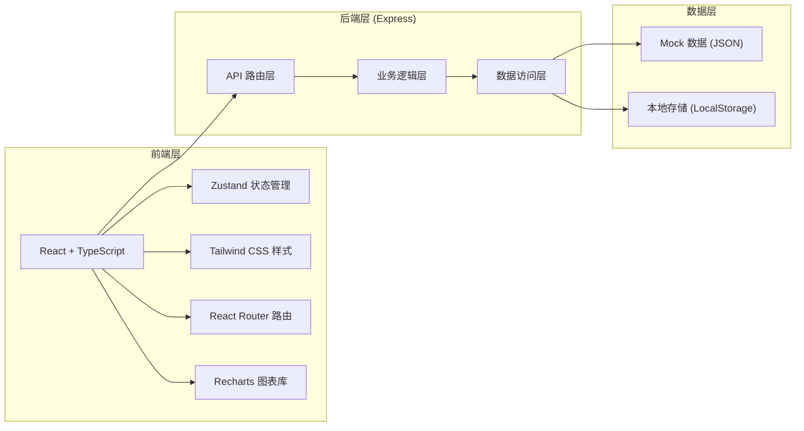
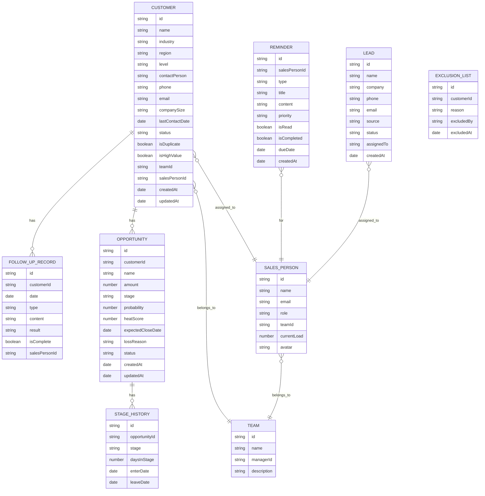

## 1. 架构设计



## 2. 技术选型说明

- **前端框架**: React 18 + TypeScript
- **构建工具**: Vite
- **样式方案**: Tailwind CSS 3
- **状态管理**: Zustand
- **路由管理**: React Router DOM 6
- **图表库**: Recharts
- **图标库**: Lucide React
- **后端框架**: Express 4 + TypeScript
- **数据存储**: Mock 数据 + LocalStorage（前端持久化）
- **初始化工具**: vite-init

## 3. 路由定义

| 路由路径 | 页面名称 | 功能说明 |
|----------|----------|----------|
| /dashboard | 仪表盘 | 总览数据展示、关键指标、今日待办 |
| /customer-scan | 客户扫描 | 客户列表、筛选、重复检测、高价值标记 |
| /follow-up-check | 跟进检查 | 跟进记录检查、联系人补充提醒 |
| /opportunity-score | 商机评分 | 商机热度评分、成交概率评估 |
| /reminders | 提醒中心 | 今日必访清单、个人提醒管理 |
| /lead-assignment | 线索分配 | 新线索分配、负载均衡、手动调整 |
| /exception-summary | 异常汇总 | 丢单原因、风险客户、异常统计 |
| /reports | 数据报表 | 团队日报、多维度统计、导出 |
| /settings | 系统设置 | 团队管理、排除名单、规则配置 |

## 4. 数据模型

### 4.1 实体关系图



### 4.2 核心数据类型定义

```typescript
// 客户类型
interface Customer {
  id: string;
  name: string;
  industry: string;
  region: string;
  level: 'A' | 'B' | 'C' | 'D';
  contactPerson: string;
  phone: string;
  email: string;
  companySize: string;
  lastContactDate: string;
  status: 'active' | 'inactive' | 'lost';
  isDuplicate: boolean;
  isHighValue: boolean;
  teamId: string;
  salesPersonId: string;
  daysSinceLastContact: number;
  followUpCount: number;
}

// 商机类型
interface Opportunity {
  id: string;
  customerId: string;
  customerName: string;
  name: string;
  amount: number;
  stage: string;
  probability: number;
  heatScore: number;
  expectedCloseDate: string;
  lossReason?: string;
  status: 'active' | 'won' | 'lost';
  daysInCurrentStage: number;
  createdAt: string;
}

// 跟进记录类型
interface FollowUpRecord {
  id: string;
  customerId: string;
  customerName: string;
  date: string;
  type: 'call' | 'meeting' | 'email' | 'visit';
  content: string;
  result: string;
  isComplete: boolean;
  salesPersonId: string;
  salesPersonName: string;
}

// 提醒类型
interface Reminder {
  id: string;
  salesPersonId: string;
  salesPersonName: string;
  type: 'visit' | 'follow_up' | 'contact' | 'deadline';
  title: string;
  content: string;
  priority: 'high' | 'medium' | 'low';
  isRead: boolean;
  isCompleted: boolean;
  dueDate: string;
  customerId?: string;
  customerName?: string;
  createdAt: string;
}

// 线索类型
interface Lead {
  id: string;
  name: string;
  company: string;
  phone: string;
  email: string;
  source: string;
  status: 'new' | 'assigned' | 'contacted' | 'converted';
  assignedTo?: string;
  assignedToName?: string;
  createdAt: string;
}

// 销售人员类型
interface SalesPerson {
  id: string;
  name: string;
  email: string;
  role: 'manager' | 'sales';
  teamId: string;
  currentLoad: number;
  customerCount: number;
  avatar?: string;
}

// 团队类型
interface Team {
  id: string;
  name: string;
  managerId: string;
  description: string;
  memberCount: number;
}

// 异常汇总类型
interface ExceptionSummary {
  id: string;
  type: 'lost_reason' | 'long_stage' | 'no_contact' | 'duplicate';
  title: string;
  count: number;
  details: string;
  date: string;
}

// 日报数据类型
interface DailyReport {
  date: string;
  teamId: string;
  teamName: string;
  totalCustomers: number;
  newCustomers: number;
  totalOpportunities: number;
  wonOpportunities: number;
  totalAmount: number;
  followUpCount: number;
  reminderCount: number;
  exceptionCount: number;
}
```

## 5. 核心模块设计

### 5.1 客户扫描模块

- **扫描规则**: 按团队/行业/区域筛选，识别30天未联系客户，检测重复客户
- **评分逻辑**: 基于客户级别、成交金额、合作潜力计算高价值客户
- **输出结果**: 客户列表、筛选条件、统计数据

### 5.2 跟进检查模块

- **完整性检查**: 检查跟进记录是否包含必要字段（内容、结果、下次计划）
- **联系人提醒**: 标记缺少关键联系人信息的客户
- **阶段统计**: 计算商机在各阶段的停留天数

### 5.3 商机评分模块

- **评分维度**: 客户级别、金额大小、阶段进度、跟进频率、竞争情况
- **热度计算**: 综合各维度加权计算商机热度分数
- **分级标准**: A级(80-100)、B级(60-79)、C级(40-59)、D级(<40)

### 5.4 提醒生成模块

- **必访清单**: 自动识别今日需要拜访的高优先级客户
- **提醒类型**: 跟进提醒、联系人补充提醒、阶段超时提醒
- **处理记录**: 记录提醒处理状态和时间

### 5.5 名单分配模块

- **分配策略**: 按当前负载均衡分配，考虑行业专长匹配
- **自动分配**: 新线索进入后自动分配给合适的销售人员
- **手动调整**: 支持主管手动调整分配结果

### 5.6 异常汇总模块

- **丢单分析**: 统计丢单原因分布，识别主要问题
- **异常识别**: 长期未跟进、阶段停留过长、客户信息不完整
- **风险标记**: 标记高风险客户，提前预警

### 5.7 报表输出模块

- **日报生成**: 每日自动生成团队销售日报
- **多维度统计**: 按团队、人员、行业、区域统计
- **导出功能**: 支持导出为 Excel/PDF 格式

## 6. 项目结构

```
├── src/                    # 前端源码
│   ├── components/         # 公共组件
│   │   ├── layout/         # 布局组件
│   │   ├── ui/             # UI 基础组件
│   │   └── charts/         # 图表组件
│   ├── pages/              # 页面组件
│   ├── store/              # Zustand 状态管理
│   ├── hooks/              # 自定义 Hooks
│   ├── utils/              # 工具函数
│   ├── types/              # TypeScript 类型定义
│   ├── data/               # Mock 数据
│   ├── App.tsx             # 应用入口
│   └── main.tsx            # 主入口
├── api/                    # 后端源码
│   ├── routes/             # API 路由
│   ├── services/           # 业务逻辑
│   ├── data/               # 数据访问
│   └── index.ts            # 服务入口
├── shared/                 # 共享类型
├── .trae/
│   └── documents/          # 项目文档
├── package.json
├── vite.config.ts
├── tailwind.config.js
├── tsconfig.json
└── README.md
```

